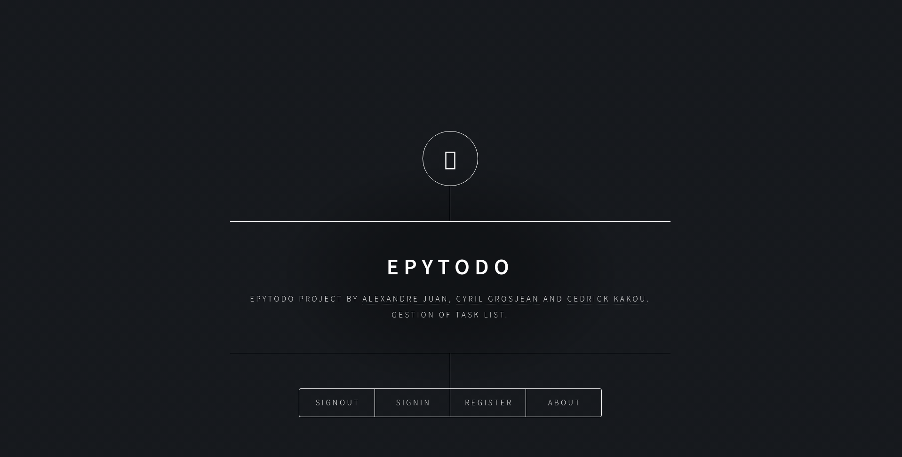
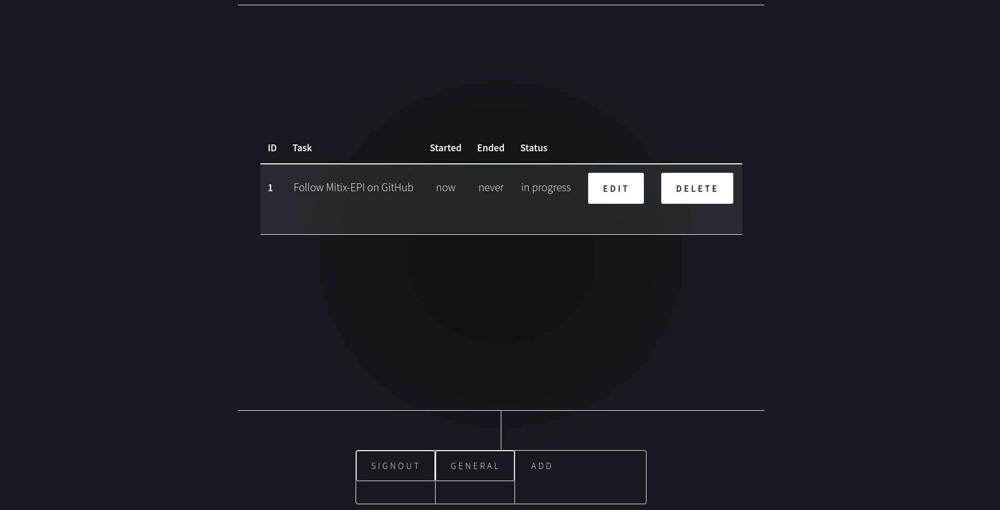
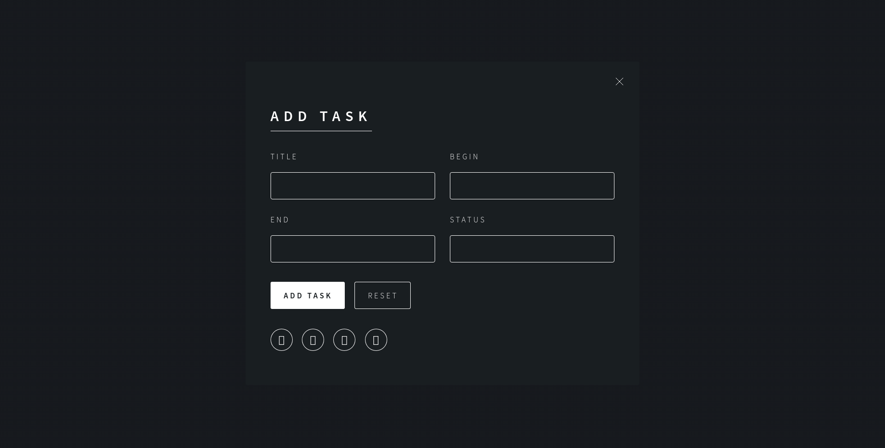

# WEB_epytodo_2019

EPyTodo is a project which you could rely on in the future.
You'll use some tools to help you (framework) in order to implement quickly some part of your project.
Into this, you’ll have to develop:
1. your MySQL database scheme
2. your web server using Flask
3. your HTML pages using Jinja2 (integrated with Flask)

USAGE:

    ./run.py
    
MUST:

**change the Database Password in config.py**

    DEBUG	      	= True
    TESTING 	    = True

    DATABASE_NAME = "epytodo"
    DATABASE_HOST = ""
    DATABASE_SOCK = None
    DATABASE_USER = "root"
    DATABASE_PASS = "" #here
    

# VISUALISATION

**Main Page**

**Register**

**Signin**

**User Board**

**All User Tasks**

**Add Task**

